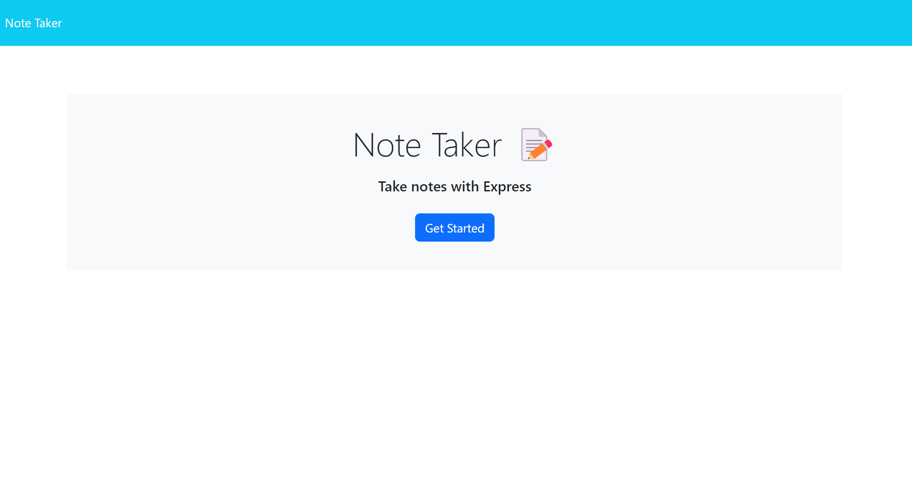
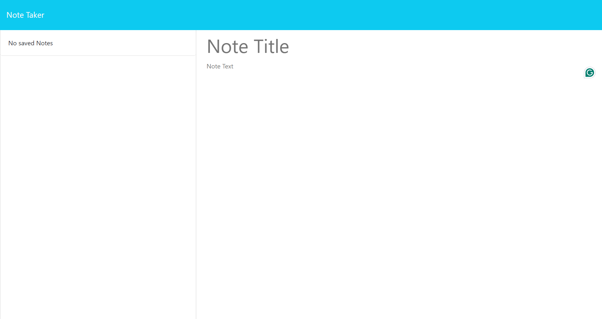
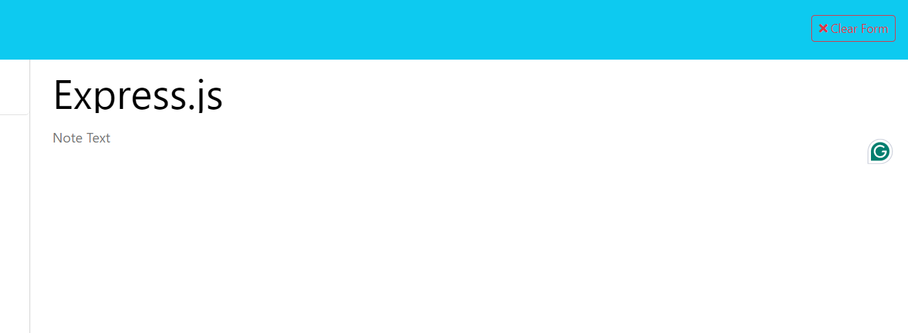
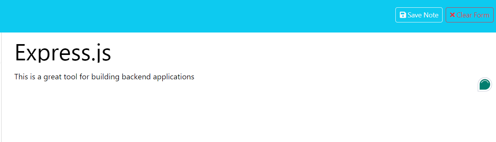
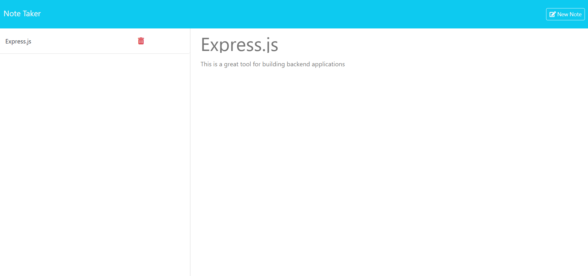
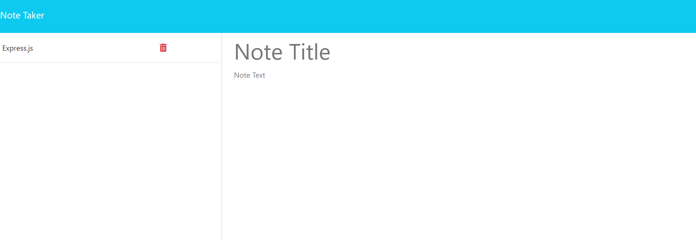

# Express.js Note Taker

## Description

For this assignment, I was tasked with building the back end for a note taking application by modifying starter code so that the application can be used to write and save notes. The main goal of this assignment, was to use Express.js to retreive and store data to and from a JSON file.

## Installation

Before writing the actual code, I began by installing express. After that, I created my routes files to handle the GET, POST, and DELETE routes. I was given the page routes to render the correct HTML pages based on where the user wants to go. I was also given all the front-end logic and styling (and the HTML) so all I had to do was complete the routes for creating, saving, and viewing the notes.

I started by creating my path to the JSON file and then building my functions to handle reading (readNotes()) and writing to that file (writeNotes()) by using the fs.readFileSync() and fs.writeFileSync() functions.

After that, I created my GET route by using that readNotes() function I had already created and then from there I created my POST route to handle adding new notes to the file. I once again used the readNotes() function and assigned it to a variable called notes. I then pushed the req.body being pulled from the front-end into that variable and used the writeNotes() function to write that data to the JSON file. For the DELETE route, I used the readNotes() function once again and then used the filter function to filter out all of the notes with ID's that matched the ID in the parameters and then used the writeNotes() to write the newly filtered data back to the JSON file.

After the routes were done, I just had to export my router to the server.js so that the application would use them.

## Usage

To use the deployed website click

Once you are there, you will see a button to 'Get Started' on taking notes.

When that is clicked, you will be taken to a new page where you will see existing notes (if any) and an area to add a new note with a note title and note text.

When a note title is added, a button to clear the form will appear in the navbar. When that is clicked the form will be cleared.

When a note text (with a note title) is added, you will then see an additional button to save the note appear in the navbar.

When that is clicked, the note will be saved and added to the list of existing notes on the left side of the page with a trash icon next to it. Additionally, when that note is clicked on, it will display the title and text for that note and a button will appear in the navbar to add a new note.

When that button is clicked, an empty notes form will once again appear for you to create a new note.

When the trash icon next to an existing note is clicked, it will delete that note.
